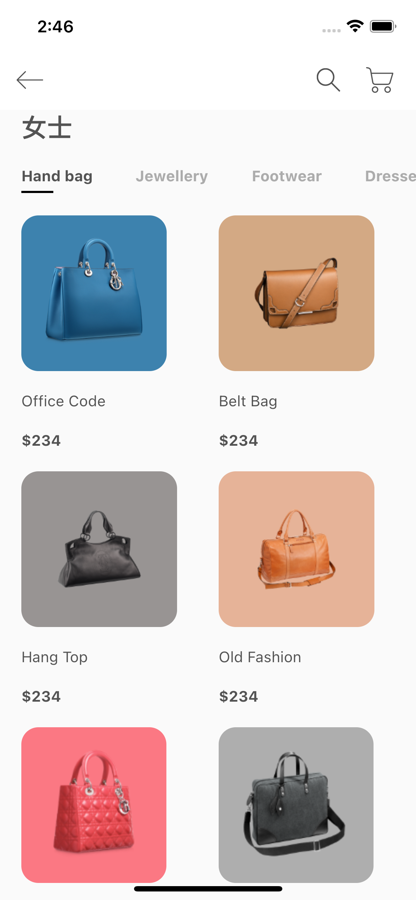
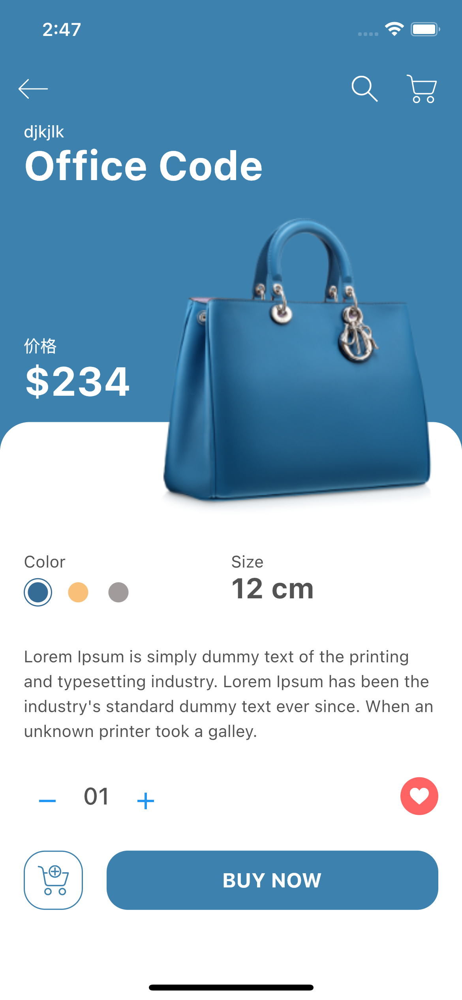

# e_shop





## version 2.5.1 Null Safety

### package
- flutter_svg: ^0.23.0+1 Null Safety


class ProductModel {
  final String? image, title, description;
  final int? price, size, id;
  final Color? color;
  ProductModel({
    this.id,
    this.image,
    this.title,
    this.price,
    this.description,
    this.size,
    this.color,
  });
}

```

### 设置视觉密度：适应平台密度

```
      theme: ThemeData(
        textTheme: Theme.of(context).textTheme.apply(bodyColor: kTextColor),
         visualDensity: VisualDensity.adaptivePlatformDensity,
      ),

```

### childAspectRatio 宽高比设定

```
        Expanded(
          child: GridView.builder(
            itemCount: products.length,
            gridDelegate: const SliverGridDelegateWithFixedCrossAxisCount(
              crossAxisCount: 2,
              childAspectRatio: 0.75,//宽高比设定
            ),
            itemBuilder: (context, index) => ItemCard(),
          ),
        ),

```

### null safety 中textTheme的copywith 用法  headline5?.copyWith

```
                          Expanded(
                            child: RichText(
                              text: TextSpan(
                                style: const TextStyle(
                                  color: kTextColor,
                                ),
                                children: [
                                  const TextSpan(
                                    text: 'Size\n',
                                  ),
                                  TextSpan(
                                      text: '${productModel?.size} cm',
                                      style: Theme.of(context)
                                          .textTheme
                                          .headline5
                                          ?.copyWith(
                                            fontWeight: FontWeight.bold,
                                          )),
                                ],
                              ),
                            ),
                          ),

```

### color 圆环

```
                              Container(
                                padding: const EdgeInsets.all(
                                  2.5,
                                ),
                                height: 24,
                                width: 24,
                                decoration: BoxDecoration(
                                  shape: BoxShape.circle,
                                  border: Border.all(
                                    color: const Color(0xFF356C95),
                                  ),
                                ),
                                child: const DecoratedBox(
                                  decoration: BoxDecoration(
                                    color: Color(0xFF356C95),
                                    shape: BoxShape.circle,
                                  ),
                                ),
                              ),
                              

```

### padLeft 

```

Text(numOfItems.toString().padLeft(2, '0')
String padLeft(int width, [String padding = ' ']);

```

### ButtonStyle

```

ButtonStyle(
                  backgroundColor: MaterialStateProperty.all(
                      productModel?.color ?? Colors.transparent),
                  shape: MaterialStateProperty.all(
                    RoundedRectangleBorder(
                      borderRadius: BorderRadius.circular(18),
                    ),
                  ),
                )
                
```
